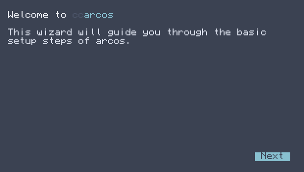
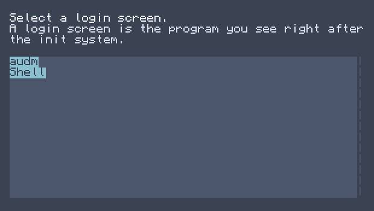
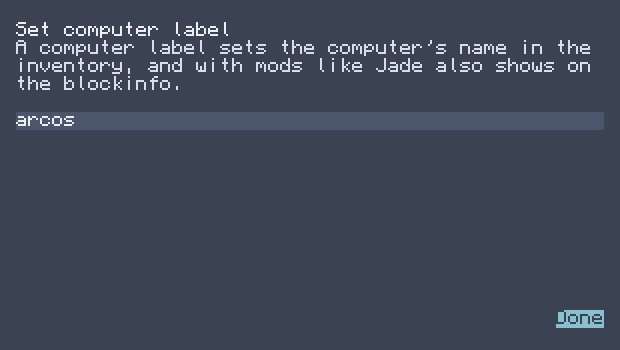
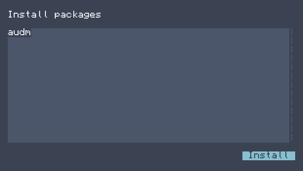
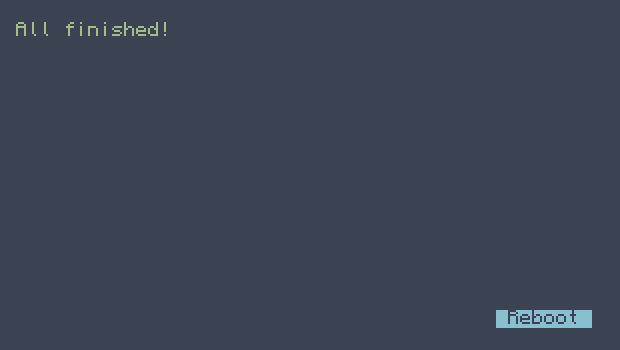

Installation
===============

| To install arcos2, simply run ``wget run https://raw.githubusercontent.com/mirkokral/ccarcos/main/build/system/installer.lua``.  
| The installer erases all files in the root directory and copies arcos2 files into it.

| After the installation finishes, you'll see the following screen:

| After you click "Next", you'll see the following screen:

| Here, it is recommended to select "nex" (When it becomes available) or meanwhile "audm"
| If you don't want any user and password prompt, select "Shell".
| After you select a login screen, you'll be met with this screen:

| Here, you select a computer label. 
| This shows up on the shell, when you pickup the computer or in mods like WAYLA or JADE

| After this, you'll see the following screen:

| Here, review the packages to install and then click "Install"
| After this, you will see the following screen:

| On this screen just click reboot.